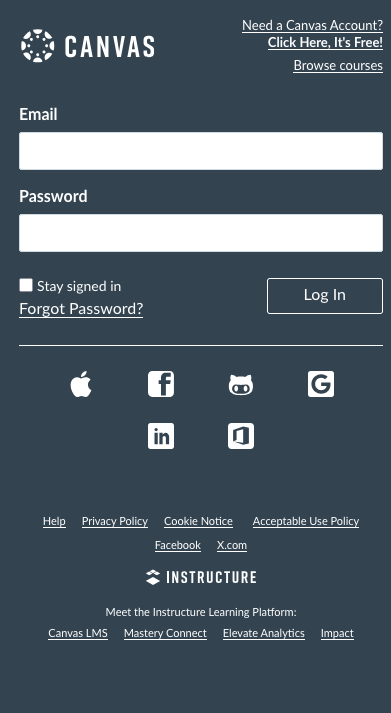
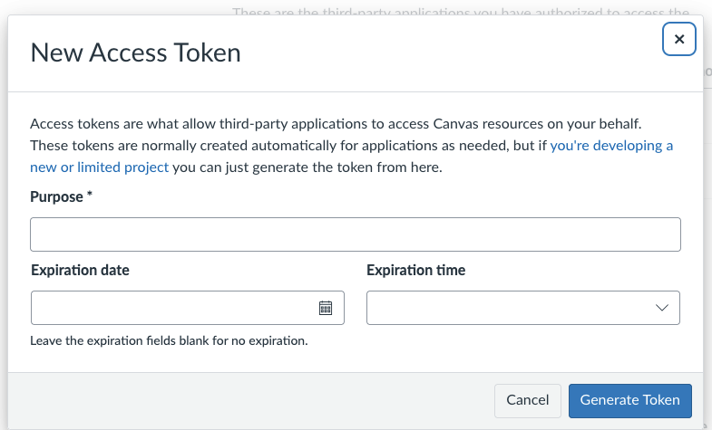

# Welcome to the StudyPlanner App!

This is a Application that allows for integration with the Canvas Instructure solution. 

# Main Goals
1. Create an interface to display courses, assignments, and corresponding due dates.  
2. Fetch courses and details from canvas using their API. 
3. Navigate between a main dashboard listing all courses and a page for each course with more details 

# Instructions for running Application
### Obtaining the API Key from Canvas
Before you run this application, you must grab an associated API key from an account created by you on Canvas. Currently, we are not able to obtain an API key from UC's Canvas Instance as they have it disabled.

1. Proceed to [here](https://canvas.instructure.com) and log into the prompt below.
   

2. Once Logged in go to **Account > Settings** then click on "New Access Token", fill in the information on the screen below.

3. Once you hit "Generate Token" make sure to copy down the token that is generated as you will not be able to copy it later!
4. Next make sure your .NET MAUI environment is set up according to the initial class instructions.
5. Next make sure to view the video down below for initial set up and follow up instructions when running the application.
TODO: Video presentation linked below.

